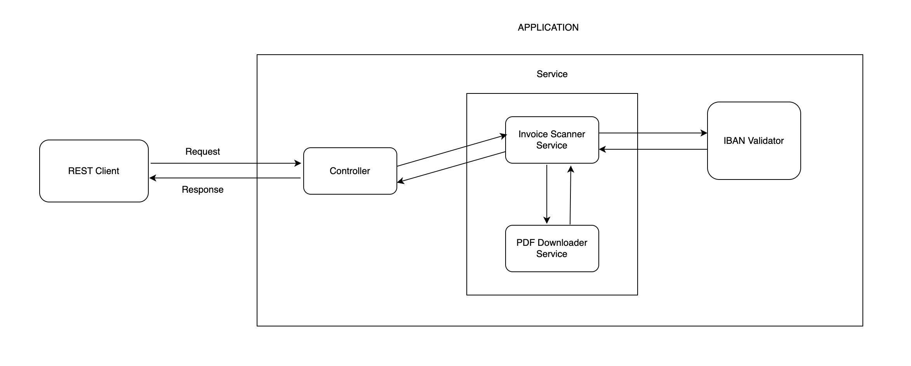

# Invoice Scanner Service

This is a Spring Boot application that scans PDF invoices for blacklisted IBANs.

## How to Run

### Using Maven
1. Clone the repository.
2. Run `./mvnw clean install` to build the project.
3. Run `./mvnw spring-boot:run` to start the application.
4. Access the API at `http://localhost:8080/api/invoices/scan`.

### Using Docker
1. Clone the repository.
2. Run `docker build -t invoice-scanner .` to build the Docker image.
3. Run `docker run -p 8080:8080 --name invoice-scanner-app invoice-scanner` to start the application.

## API Endpoint
- **POST /api/invoices/scan**: Scans a PDF invoice for blacklisted IBANs.
    - Query Parameter: `url` (URL of the PDF file or `classpath:` path for resources).


- Sample Request:
    ```bash
    curl -X POST "http://localhost:8080/api/invoices/scan?url=classpath:samples/example_invoice.pdf"
    ```

## Example PDF
An example PDF (`example_invoice.pdf`) is provided in the `/resources/samples` folder for testing.

## Blacklisted IBANs
Blacklisted IBANs are stored in `src/main/resources/samples/blacklisted_ibans.txt`. If you want to add more blacklisted IBANs, add them to this file i.e. one IBAN per line.
The IBAN that was used in the example PDF is inside the file `src/main/resources/samples/blacklisted_ibans_from_example_invoice.txt`.
If you want to test the example PDF, you can add this IBAN to the `blacklisted_ibans.txt` file.

> **⚠️ Important Note:** When `blacklisted_ibans.txt` is updated, make sure to rerun the application to reload the blacklisted IBANs.

## Testing
Run unit tests using `mvn test`.

## System Design Overview



## Improvements
- Add authentication for API access.
- Support for non-selectable PDFs using OCR.
